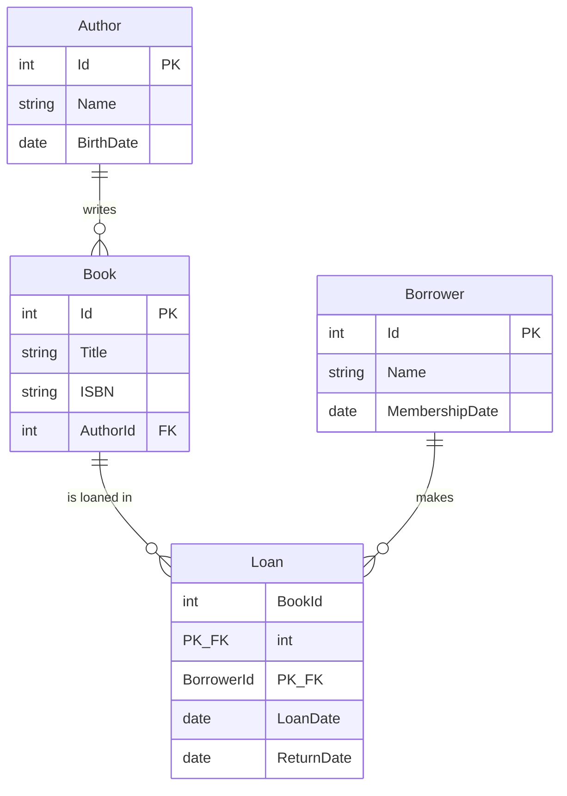

## ER Diagram

```mermaid
erDiagram
    Author  ||--o{ Book  : writes
    Book    ||--o{ Loan  : "is loaned in"
    Borrower||--o{ Loan  : makes
    Author { int Id PK  string Name  date BirthDate }
    Book { int Id PK  string Title  string ISBN  int AuthorId FK }
    Borrower { int Id PK  string Name  date MembershipDate }
    Loan { int BookId PK_FK  int BorrowerId PK_FK  date LoanDate  date ReturnDate }
```

